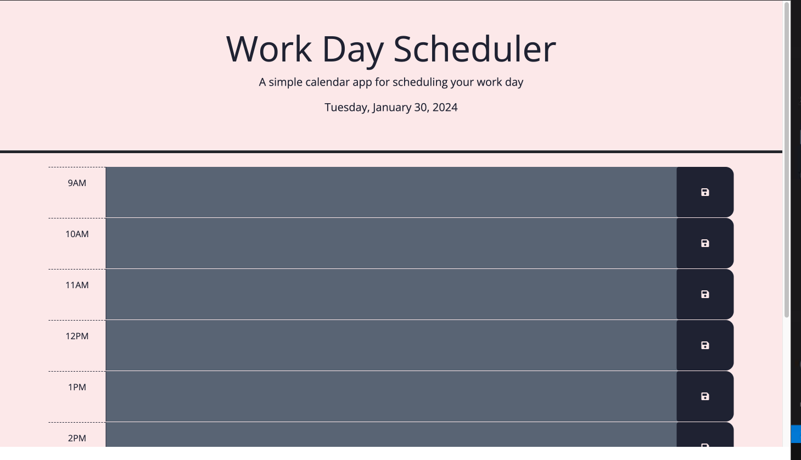

# Work-Day-Scheduler

## User Story

AS A developer with a busy schedule
I WANT to add important events to a daily planner between the hours of 9am and 5pm
SO THAT I can manage my time effectively

## Acceptance Criteria

GIVEN I am using a daily planner to create a schedule
WHEN I open the planner
THEN the current day is displayed at the top of the calendar
WHEN I scroll down
THEN I am presented with time blocks for standard business hours of 9am to 5pm
WHEN I view the time blocks for that day
THEN each time block is color-coded to indicate whether it is in the past, present, or future
WHEN I click into a time block
THEN I can enter an event
WHEN I click the save button for that time block
THEN the text for that event is saved in local storage
WHEN I refresh the page
THEN the saved events persist

## Assets

The following image demonstrates the web application's appearance and functionality:

## Deployment

https://jackegould.github.io/work-day-scheduler/
